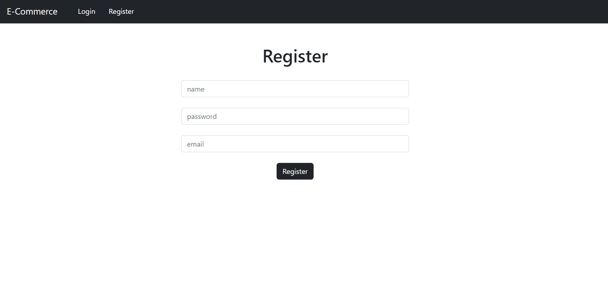
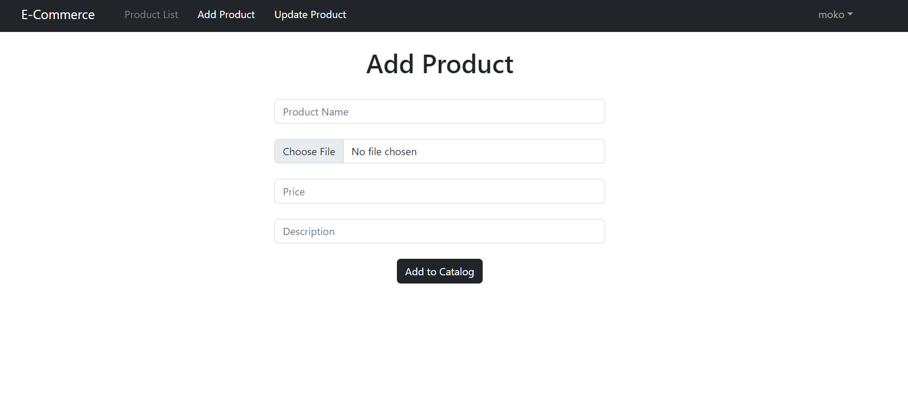
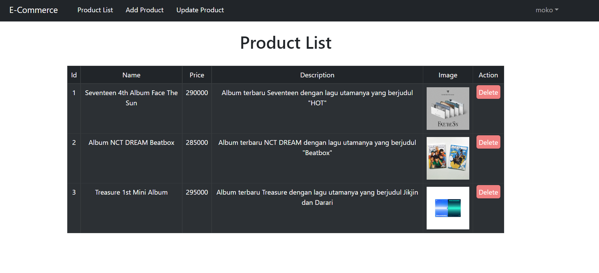
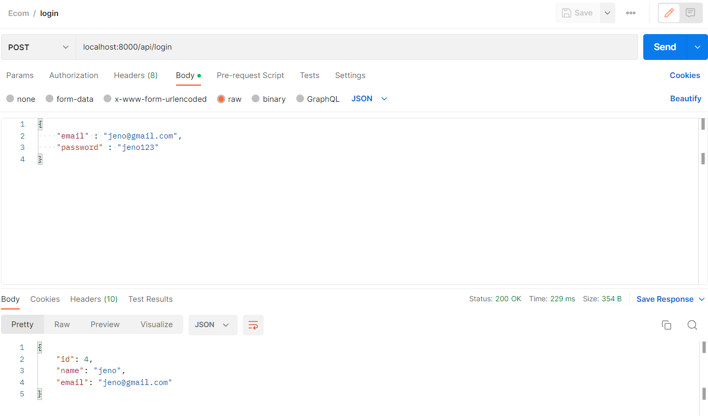
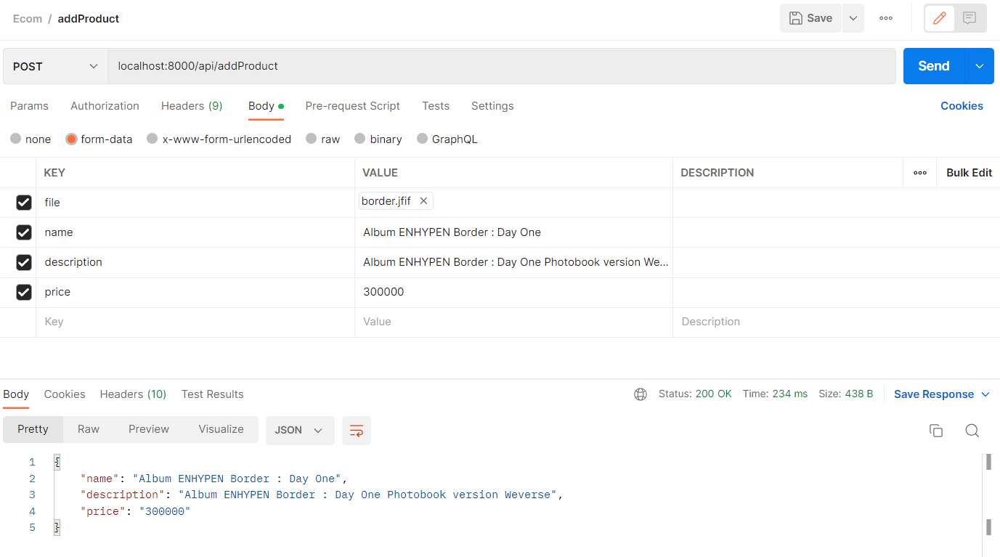
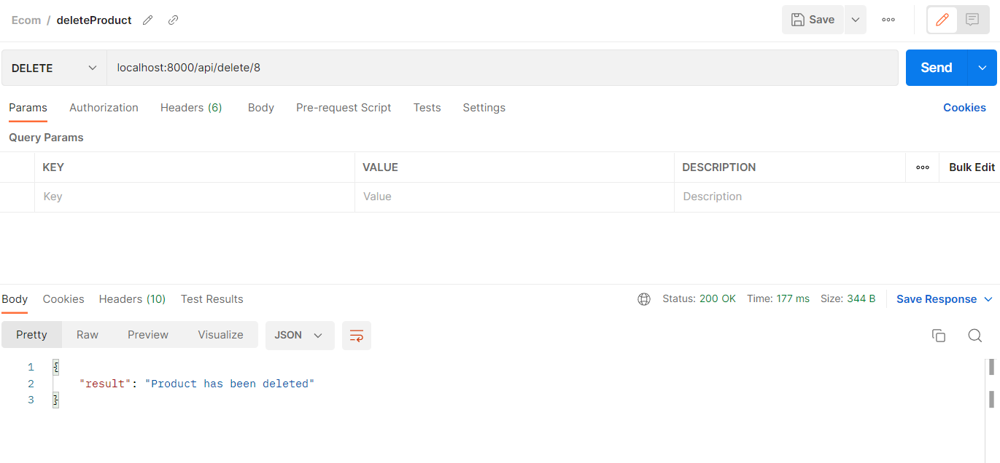

# Simple-E-Commerce-Using-React-JS-React-Bootstrap-Front-End-and-Laravel-Backend

## Front-End (React JS, React Bootstrap)
### 1. Login

### 2. Register

### 3. Add product

### 4. Product List

## Backend (PHP Laravel)
### 1. Tes Login pada Postman
Method : POST
 
Params : JSON {email, password} 

### 2. Tes Register pada Postman
Method : POST
 
Params : JSON {name, email, password}

### 3. Tes Add Product pada Postman
Method : POST
 
Params : form-data {file, name, description, price}
Disini user dapat mengupload data produk yang akan mereka jual pada e-commerce

### 4. Tes Get Product pada Postman
Method : GET
 
Params : Null

### 5. Tes Delete Product pada Postman
Method : DELETE
 
Params : {id}

